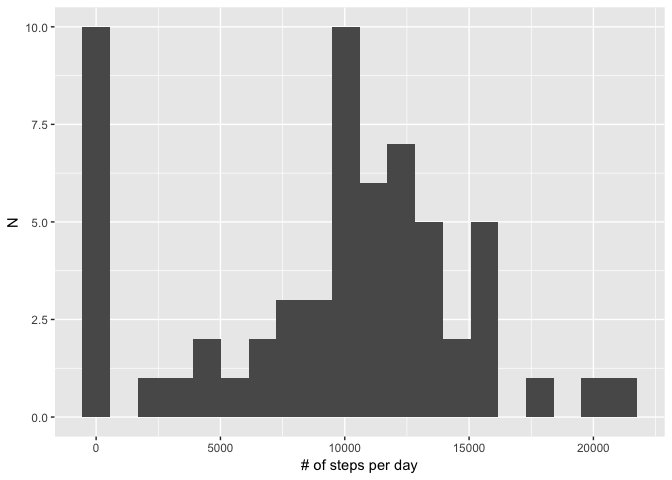
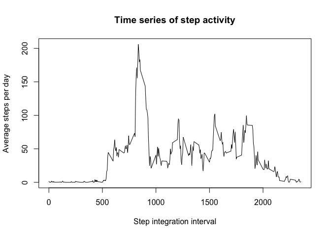
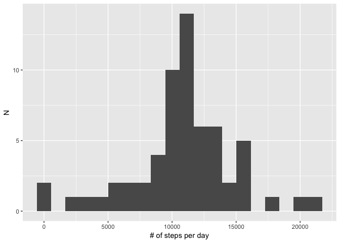
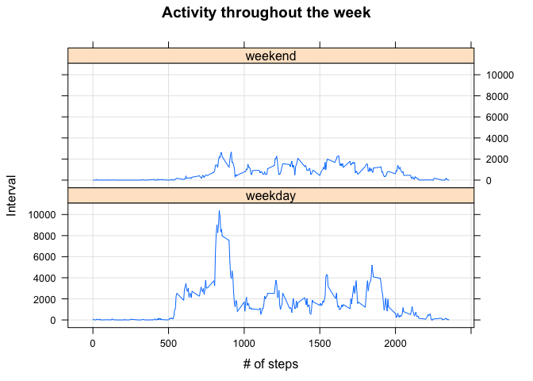

```r
library(dplyr)
library(ggplot2)
library(lubridate)
library(lattice)
```

## Loading and preprocessing the data
Unzip the file and read it as a CSV.

```r
unzip('activity.zip',overwrite=TRUE)
data = read.csv('activity.csv')
```


## What is mean total number of steps taken per day?
We'll group the dataset by dates and sum over steps for each day.

```r
steps_per_day = data %>% group_by(date) %>% summarize(totalsteps=sum(steps,na.rm=TRUE))
qplot(steps_per_day$totalsteps,geom='histogram',bins=20)+
    labs(x='# of steps per day',y="N")
```

<!-- -->


```r
avg1=mean(steps_per_day$totalsteps)
med1=median(steps_per_day$totalsteps)
```
The mean and median number of steps taken each day are 9354.2295082 and 10395, respectively.

## What is the average daily activity pattern?
We want to group by time interval and take the average.

```r
steps_per_interval = data %>% group_by(interval) %>%
    summarize(avgsteps=mean(steps,na.rm=TRUE))
with(steps_per_interval,plot(interval,avgsteps,type='l',
     main='Time series of step activity',
     ylab='Average steps per day',xlab='Step integration interval'))
```

<!-- -->


```r
maxval = steps_per_interval %>% filter(avgsteps==max(avgsteps)) %>% select(interval)
```
The step interval with the highest average number of steps is #835.

## Imputing missing values

```r
n_na = sum(is.na(data$steps))
```
There are 2304 values in the dataset that are missing. Let's fill them in with the mean of steps for that day.

```r
data_new = data.frame(data)
aspi = data %>% group_by(interval) %>% summarize(n=mean(steps,na.rm=TRUE))
for(i in aspi$interval){
    data_new[data$interval==i & is.na(data$steps),"steps"] = aspi$n[aspi$interval==i]
}
```
Let's plot a histogram of total number of steps taken each day.

```r
steps_per_day_new = data_new %>% group_by(date) %>%
    summarize(totalsteps=sum(steps,na.rm=TRUE))
qplot(steps_per_day_new$totalsteps,geom='histogram',bins=20)+
    labs(x='# of steps per day',y="N")
```

<!-- -->

```r
avg2=mean(steps_per_day_new$totalsteps)
med2=median(steps_per_day_new$totalsteps)
```
When the NA values are replaced, the mean and median are 1.0766189\times 10^{4} and 1.0766189\times 10^{4}, respectively. Both values increased from before.


## Are there differences in activity patterns between weekdays and weekends?

```r
dow = wday(as.Date(data_new$date))
data_new$week = as.factor(ifelse(wday(as.Date(data_new$date)) %in% c(1,7),'weekend','weekday'))
byweek = data_new %>% group_by(week,interval) %>% summarize(nsteps=sum(steps))
xyplot(nsteps~interval | week, byweek, grid=TRUE,type='l',layout=c(1,2),xlab='# of steps',ylab='Interval',main='Activity throughout the week')
```

<!-- -->

This person experiences more activity in general on weekdays compared to the weekends.
